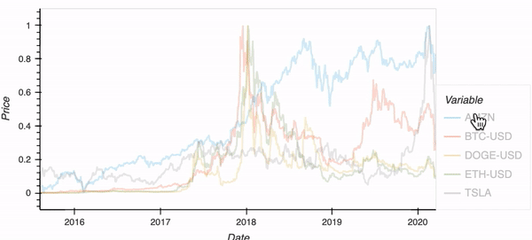

# Invest-a-Bull

Invest-a-Bull is an investment tool that allows users to pick up to five different stocks and/or cryptocurrencies and analyze whether these chosen five assets are indeed worth the investment. 

The Invest-a-Bull Dashboard provides users with different insights on their chosen assets including (but not limited to): the sharpe ratio, volatility, their correlation between one another, and a portfolio performance projection of those assets using a Monte Carlo simulation. 

As a hedge against regular market volatility, this tool also includes an option for users to lend a portion of their total investments where users can earn passive income based on the internal rate of return (XIRR) function that our team created.

Lastly, users will be able to input themselves the total amount of investment, the duration of their investment, and their risk tolerance. 

