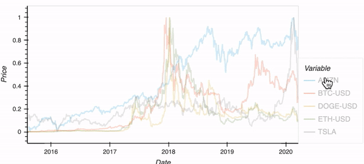

# Invest-a-Bull

Invest-a-Bull is a **senior-level, reproducible market-analysis project** that identifies and analyzes the **latest top 5 trending U.S. stocks** using live Yahoo Finance data, a package-based analytics pipeline, and a scheduled notebook automation workflow.

The refreshed project combines:

- live market screening
- momentum and liquidity scoring
- history-quality validation
- equal-weight portfolio analytics
- robust Monte Carlo scenario modeling
- automated report, notebook, and README refreshes



<!-- AUTO-GENERATED:START -->
## Latest generated result

Most recent successful automated run:

- **Generated:** 2026-05-04 05:01:23 UTC
- **Latest market data used:** 2026-05-01
- **Selection source:** `yfinance_screeners`
- **Top 5 trending stocks:** `MU, AMD, AAOI, NVDA, INTC`
- **Lookback portfolio return:** 135.19%
- **Portfolio Sharpe ratio:** 3.14
- **Portfolio max drawdown:** -18.91%
- **Monte Carlo expected terminal return:** 478.54%
- **Monte Carlo 95% range:** 61.95% to 1277.09%

### Current top-5 snapshot

| Rank | Ticker | Company                       | Trend Score | 1M Return | 3M Return |
|------|--------|-------------------------------|-------------|-----------|-----------|
| 1    | MU     | Micron Technology, Inc.       | 0.590       | 47.40%    | 30.75%    |
| 2    | AMD    | Advanced Micro Devices, Inc.  | 0.569       | 71.51%    | 52.30%    |
| 3    | AAOI   | Applied Optoelectronics, Inc. | 0.556       | 112.52%   | 320.80%   |
| 4    | NVDA   | NVIDIA Corporation            | 0.519       | 12.92%    | 3.84%     |
| 5    | INTC   | Intel Corporation             | 0.502       | 107.41%   | 114.37%   |

See the generated deliverables:

- `reports/latest_top5_stock_report.md`
- `reports/data_quality_report.md`
- `data/processed/latest_top5_selection.csv`
- `data/processed/latest_portfolio_summary.csv`
- `reports/figures/top5_normalized_performance.png`
- `reports/figures/top5_correlation_heatmap.png`
<!-- AUTO-GENERATED:END -->

## Senior-level project upgrades

### Production-style workflow

- converted the top-level analysis into a reusable package pipeline
- added history sufficiency checks so trending selections prefer names with deeper price coverage
- upgraded scenario modeling to use a stabilized bootstrap of observed portfolio returns
- made `MasterAnalysisFinal.ipynb` suitable for automated execution and scheduled refreshes
- added daily GitHub Actions automation that can rerun the notebook and publish refreshed artifacts
- added README auto-refresh logic so the repo front page stays aligned with the latest run

## Project structure

- `run_latest_top5_analysis.py` - one-command automation entry point for pipeline, README refresh, and notebook execution
- `src/invest_a_bull/automation.py` - orchestration for daily refreshes and notebook execution
- `src/invest_a_bull/config.py` - runtime configuration
- `src/invest_a_bull/market_data.py` - screener and price-download layer
- `src/invest_a_bull/analytics.py` - ranking and portfolio analytics
- `src/invest_a_bull/simulation.py` - scenario simulation utilities
- `src/invest_a_bull/reporting.py` - report, chart, and README generation
- `src/invest_a_bull/pipeline.py` - end-to-end analysis orchestration
- `.github/workflows/daily-analysis.yml` - scheduled daily refresh workflow
- `MasterAnalysisFinal.ipynb` - executable notebook for analyst-facing review
- `masterAnalysis.ipynb` - legacy notebook version
- `tests/test_analytics.py` - automated unit tests

## Setup

Install the project dependencies:

```powershell
python -m pip install -r requirements.txt
```

Optional editable installation:

```powershell
python -m pip install -e .
```

## Run the latest analysis locally

To regenerate the top-5 trending stock analysis, reports, README summary, and executed notebook:

```powershell
python .\run_latest_top5_analysis.py
```

If the project is installed in editable mode, you can also run:

```powershell
invest-a-bull-latest
```

Optional flags:

```powershell
python .\run_latest_top5_analysis.py --skip-notebook
python .\run_latest_top5_analysis.py --skip-readme
```

## Daily GitHub automation

The repository includes `.github/workflows/daily-analysis.yml`, which:

1. runs on a daily schedule and on manual dispatch
2. installs project dependencies
3. refreshes the live market analysis
4. executes `MasterAnalysisFinal.ipynb`
5. updates `reports/`, `data/processed/`, and the README latest-results section
6. commits and pushes changed generated artifacts back to the repository

## Run tests

```powershell
python -m unittest discover -s tests -v
```

## Methodology

1. Pull candidate equities from Yahoo Finance screens:
   - `most_actives`
   - `day_gainers`
   - `growth_technology_stocks`
2. Keep only U.S.-listed equities that pass minimum price and market-cap filters.
3. Download recent adjusted-close history and prefer names with sufficient price depth.
4. Compute security-level momentum, volatility, drawdown, and liquidity features.
5. Rank the candidate universe by a weighted trend score.
6. Analyze the selected top 5 as an equal-weight portfolio.
7. Run a bootstrap-based Monte Carlo range for forward-looking scenario support.
8. Save refreshed CSV, JSON, Markdown, PNG, notebook, and README outputs.

## Notes

- The live selection is dynamic and will change as the market changes.
- If Yahoo screeners are unavailable, the pipeline falls back to a large-cap momentum universe.
- The notebook remains useful for analyst review, while the package pipeline is the operational source of truth.
- This project is for analytics and educational use only, not personalized investment advice.
